# HPC Connector on EC2

The following instructions guide how to install NICE Enginframe portal on an AWS EC2 instance.

## Walkthrough

### Launch an EC2 instance

* Sign in to your AWS account and open [EC2 console](https://console.aws.amazon.com/ec2)
* Click on "Launch Instances" button.
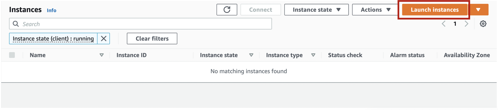
* Select Amazon Linux 2 AMI (HVM) for AMI.
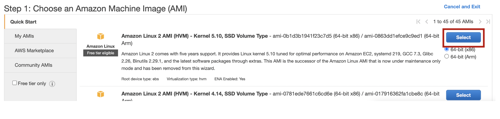
* Select instance type t2.medium and click Next.
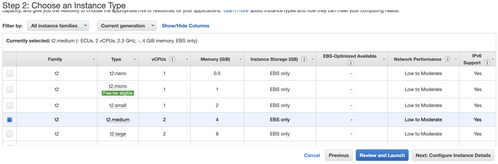
* For instance details, leave everything as default and click Next.
* For Storage, leave everything as default and click Next.
* For Tags, leave everything as default and click Next.
* For Security Group, add tcp port for 8443 and click Next.
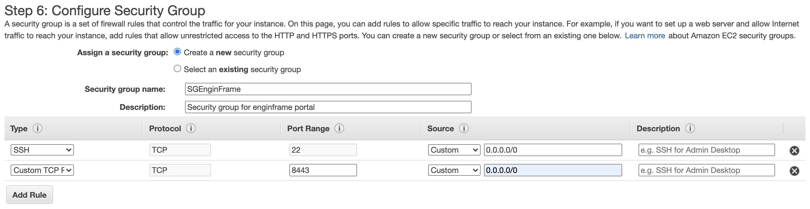
* Check your configuration and click Launch.
* Select your key pair for EC2 instance. If you already have a key pair in this region, you can use it, but if you don't have one you need to create and download a key pair.
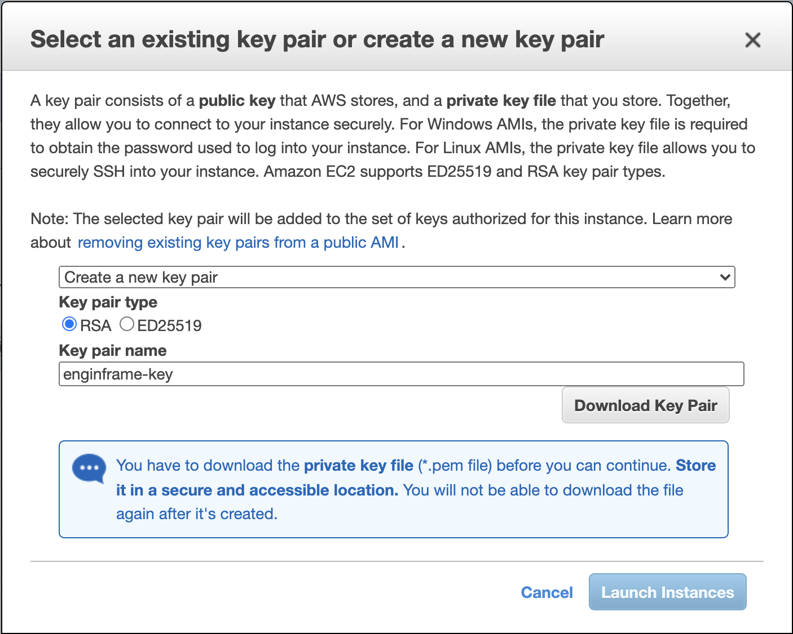

### Connect to your EC instance
* Few minutes after you launch your instance, you will be able to see your instance in [EC2 console](https://console.aws.amazon.com/ec2).
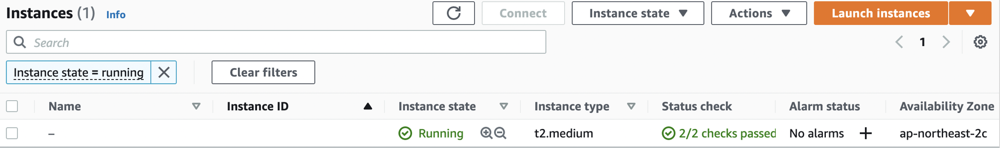
* Click on the instance id, and you will be able to see "Connect" button on upper right of the page.
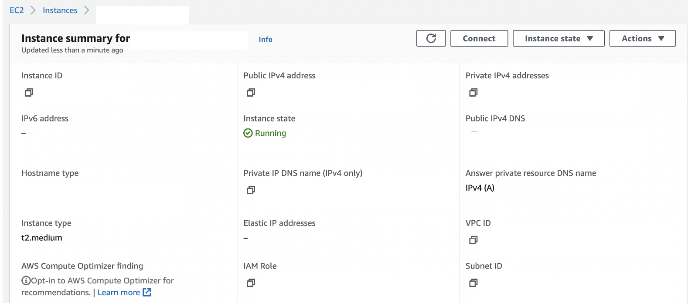
* Click "Connect" Button.
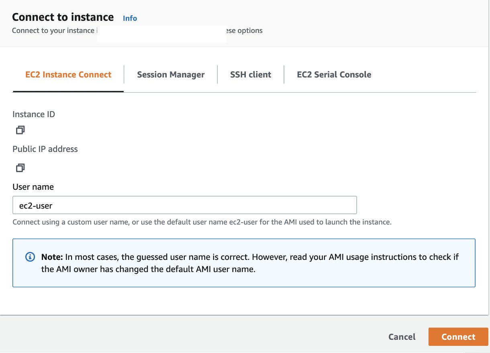
If you prefer SSH to connect with your EC2 instance, you can follow [this instruction](https://docs.aws.amazon.com/AWSEC2/latest/UserGuide/AccessingInstancesLinux.html)

### Install Prerequisites

Run following command to install git.
```
$ sudo yum install -y git
```

Clone this repository by running
```
$ git clone https://github.com/k2sebeom/hpc-connector-on-ec2.git
```
Move to the cloned repository.
```
$ cd hpc-connector-on-ec2
```

### Provision AWS Resources
To use HPC Connector on EnginFrame Portal, we need to provision some necessary AWS resources. Conveniently, AWS provides automated process of provisioning resources using CloudFormation. Go to [EnginFrame Document](https://docs.aws.amazon.com/enginframe/latest/ag/managing-hpc-connector.html#before-installing-enginframe) and click on the link of a correct region. The link will bring you to CloudFormation console. Create stack by clicking "Create Stack."


Once stack is created, you can see the created stack on [CloudFormation console](https://console.aws.amazon.com/cloudformation)

On the "Outputs" tab of the stack details, you can find the required arns for the resources. You will be addrerssed to type in these values later during the installation.


On the "Resources" tab, you can find a resource with a Logical ID "EFUser." Click the link on the Physical ID, then it will take you to IAM console.


Under "Security credentials," click "Create access key." You should copy access key id and secret access key since you can only see them when you create them. You will be addrerssed to type in these values later during the installation.


### Install Enginframe

All the scripts required to install enginframe are in the repository. You can either run scripts one by one as presented in this guide, or you can run master.sh which will execute each script in a proper order.

Before you start the install procedure, make sure you are promoted to a root user by running

```
$ sudo su root
```

1. install_dcv_broker.sh

Run the install script for NICE DCV session manager broker.
```
$ ./install_dcv_broker.sh
```
After the script is complete check that the broker is running and active by running
```
$ systemctl status dcv-session-manager-broker
```

2. install_pcluster.sh

Run the install script for pcluster.
```
$ ./install_pcluster.sh
```
You will be addressed to type in values of the AWS credentials created above.

3. parse_config.sh

Run the script to make config file for enginframe installation.
```
$ ./parse_config.sh
```
You will be addressed to type in arns of the AWS resources created above. After the script is complete, you will see a file efinstall.config created.

4. ./install_enginframe.sh

Run the install script for NICE Enginframe.
```
$ ./install_enginframe.sh
```
The script will address you to type in password for efadmin user. You will need this password to use enginframe portal.

After the script is complete check that the enginframe is running and active by running
```
$ systemctl status enginframe
```

### Open Enginframe Portal

In your EC2 console, you can find the Publilc IP address for your instance.

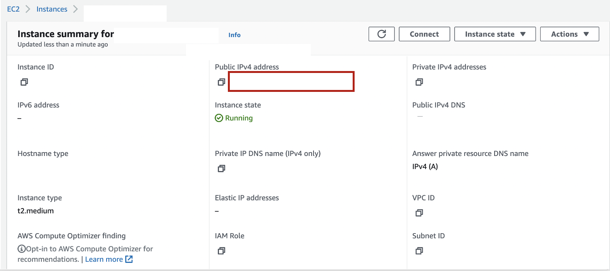

You can open the installed enginframe portal using your browser at

http://\<public ip address\>:8443

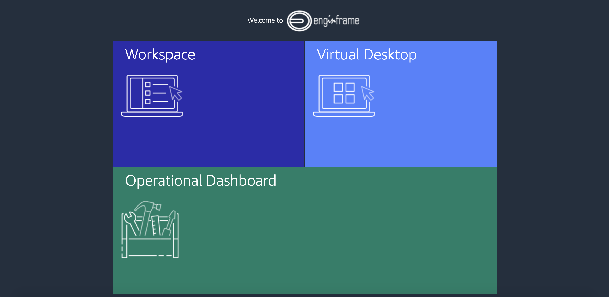

If you click on "Workspace", you will be addressed to log in. You can use username of "efadmin" and password you configured during the installation.

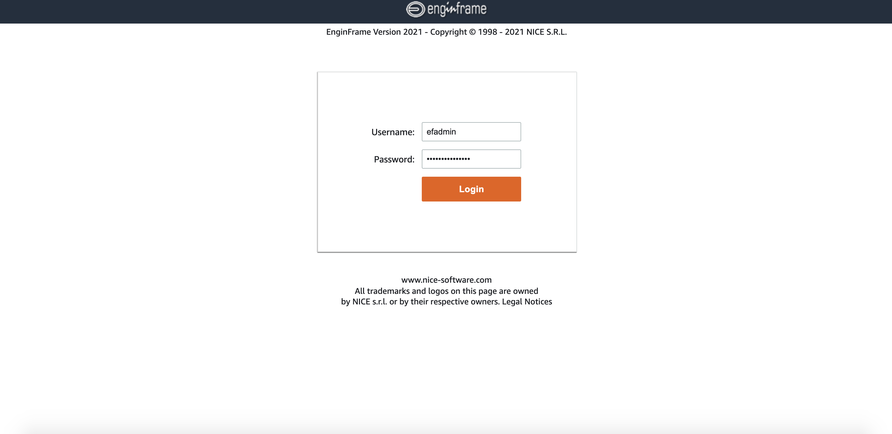

Once you are logged in, you can use the enginframe portal.

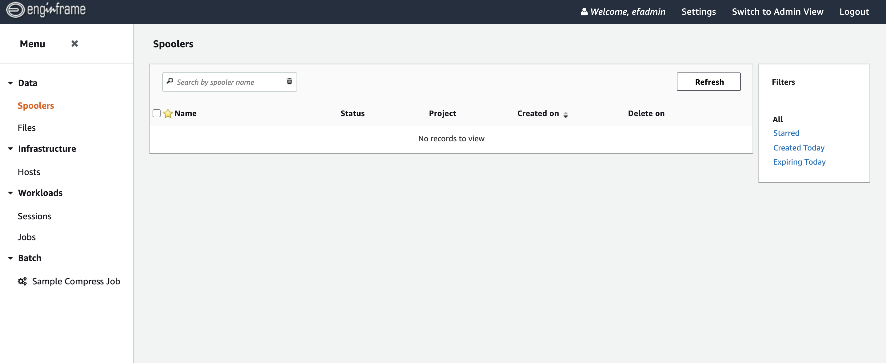